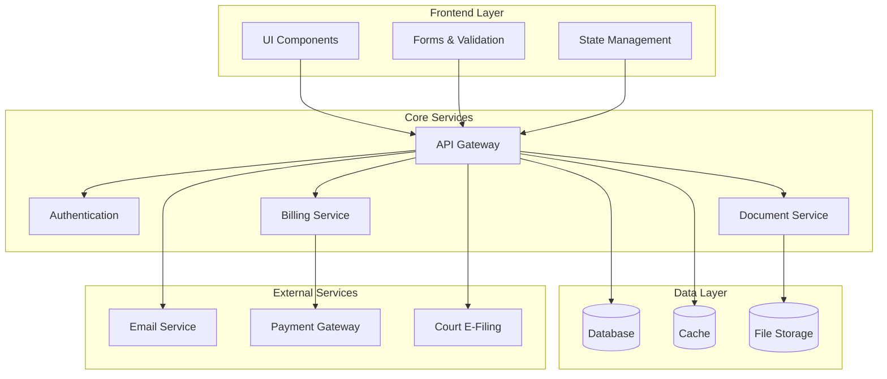
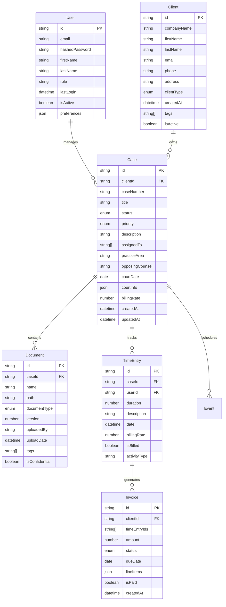
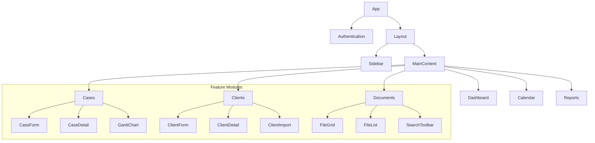
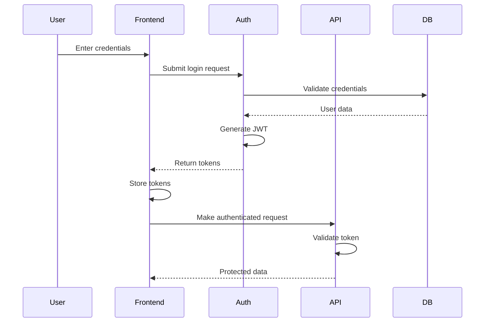
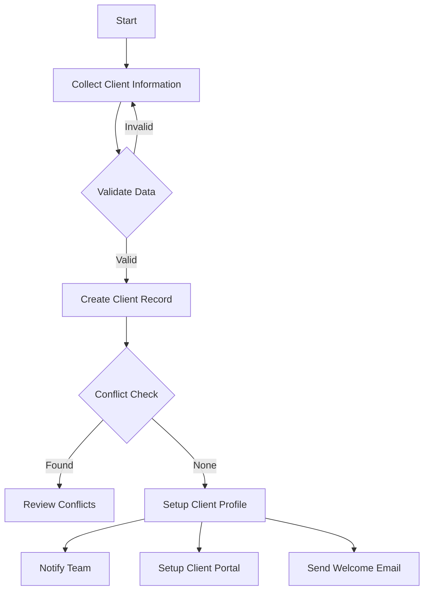
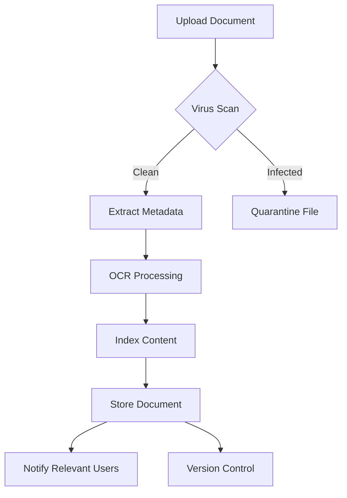

# Sebenza System - Technical Architecture Documentation

## 1. System Overview

Sebenza System is a comprehensive legal practice management platform designed specifically for modern law firms. The system streamlines daily operations, enhances client communication, and provides powerful analytics for data-driven decision making.

### 1.1 Key Features

- Client & Case Management
- Document Management with Version Control
- Time Tracking & Billing
- Client Portal
- Financial Analytics & Reporting
- AI-Assisted Legal Work
- Calendar & Task Management

## 2. System Architecture

### 2.1 High-Level Architecture

## 3. Data Models

### 3.1 Core Entities

## 4. Component Architecture

### 4.1 Frontend Component Structure

## 5. Authentication Flow

## 6. Core Workflows

### 6.1 Client Intake Process

### 6.2 Document Management Flow

## 7. Technology Stack

### 7.1 Frontend
- React 18 with TypeScript
- Tailwind CSS with shadcn/ui
- React Router v6
- React Query
- React Hook Form + Zod
- Recharts for visualization

### 7.2 Backend (Planned)
- Node.js/Express.js
- PostgreSQL
- Redis for caching
- S3-compatible storage
- JWT authentication
- WebSocket for real-time features

### 7.3 DevOps & Infrastructure
- Docker containerization
- CI/CD pipeline
- AWS/Azure cloud hosting
- Automated backups
- Monitoring & logging

## 8. Security Measures

### 8.1 Access Control Matrix

| Role          | Cases | Clients | Billing | Reports | Settings |
|---------------|-------|---------|---------|---------|-----------|
| Administrator | Full  | Full    | Full    | Full    | Full      |
| Attorney      | Full  | Read    | Write   | Read    | Limited   |
| Paralegal     | Write | Read    | None    | None    | None      |
| Client        | Read* | Own     | View    | None    | None      |

*Limited to own cases

### 8.2 Security Features
- End-to-end encryption for sensitive data
- Multi-factor authentication
- Role-based access control
- Audit logging
- Regular security assessments
- Data backup and disaster recovery

## 9. External Integrations

### 9.1 Current Integrations
- Payment processing (Stripe/PayPal)
- Email service (SendGrid)
- Document storage (AWS S3)
- Calendar sync (Google/Outlook)

### 9.2 Planned Integrations
- Court e-filing systems
- Legal research platforms
- Digital signature services
- AI/ML services for document analysis
- Time tracking tools

## 10. Performance Considerations

- React Query for efficient data caching
- Lazy loading of components and routes
- Image and document optimization
- Database indexing strategy
- CDN for static assets
- API rate limiting
- Connection pooling

## 11. Monitoring & Analytics

- Error tracking and reporting
- User behavior analytics
- Performance metrics
- Resource utilization
- Billing and revenue analytics
- Case performance metrics

## 12. Future Roadmap

### Phase 1 (Current)
- Core case management
- Basic document management
- Time tracking and billing
- Client portal

### Phase 2 (Planned)
- Advanced AI features
- Court e-filing integration
- Enhanced reporting
- Mobile application
- Workflow automation

### Phase 3 (Future)
- Machine learning for case prediction
- Blockchain for document verification
- Advanced analytics
- Integration marketplace
