# Sebenza System - Software Architecture Documentation

## Table of Contents
1. [High-Level Application Overview](#high-level-application-overview)
2. [System Architecture](#system-architecture)
3. [Key Data Models](#key-data-models)
4. [Authentication & Authorization](#authentication--authorization)
5. [Core Workflows](#core-workflows)
6. [Technology Stack](#technology-stack)
7. [Component Architecture](#component-architecture)
8. [Data Flow Diagrams](#data-flow-diagrams)
9. [API Design](#api-design)
10. [Security Architecture](#security-architecture)

---

## High-Level Application Overview

### Purpose and Target Users
Sebenza System is a comprehensive law firm management platform designed specifically for legal professionals to streamline their practice operations. The system provides end-to-end capabilities for managing clients, cases, documents, time tracking, billing, and financial operations.

**Target Users:**
- **Attorneys**: Primary case handlers requiring full access to case management, time tracking, and client communication
- **Paralegals**: Case support staff needing access to document management, research tools, and case updates
- **Administrative Staff**: Billing, scheduling, and client communication management
- **Partners**: Strategic oversight with access to analytics, financial reports, and firm performance metrics
- **Clients**: Limited portal access for case updates, document sharing, and communication

### Core Business Objectives
- **Operational Efficiency**: Streamline case management from intake to closure
- **Financial Management**: Accurate time tracking, billing, and expense management
- **Client Satisfaction**: Transparent communication and secure document sharing
- **Compliance**: Maintain legal and regulatory compliance with audit trails
- **Scalability**: Support firm growth with flexible user management and reporting

---

## System Architecture

### High-Level Architecture Diagram

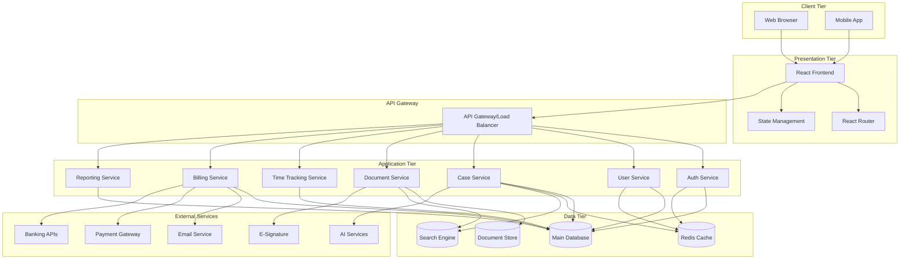

### Component Overview

| Component | Purpose | Technology |
|-----------|---------|------------|
| **Frontend Application** | User interface and user experience | React 18 + TypeScript |
| **API Gateway** | Request routing, rate limiting, authentication | Express.js/Fastify |
| **Microservices** | Business logic and data processing | Node.js/TypeScript |
| **Database** | Primary data storage | PostgreSQL |
| **Document Storage** | File storage and versioning | AWS S3/MinIO |
| **Cache Layer** | Performance optimization | Redis |
| **Search Engine** | Full-text search capabilities | Elasticsearch |

---

## Key Data Models

### Core Entity Relationships

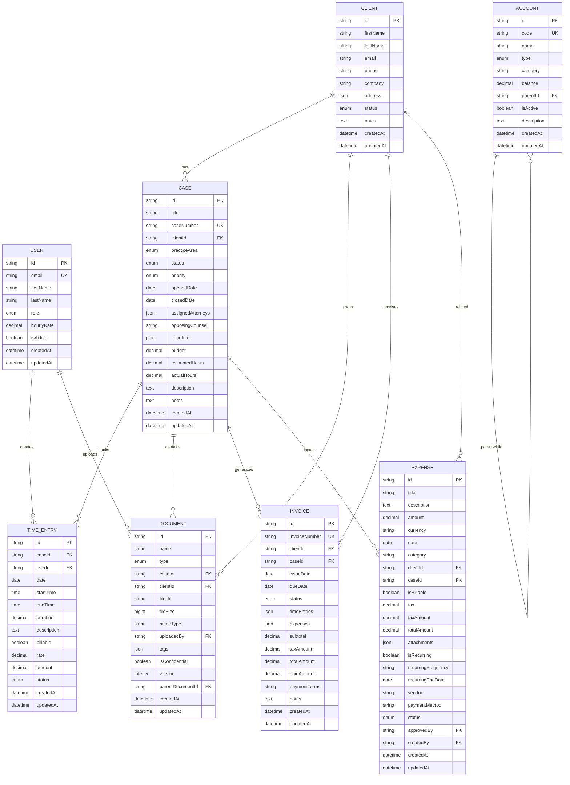

### Data Model Details

#### User Entity
```typescript
interface User {
  id: string;                    // Primary key
  email: string;                 // Unique identifier
  firstName: string;
  lastName: string;
  role: 'admin' | 'attorney' | 'paralegal' | 'assistant' | 'billing';
  hourlyRate?: number;           // Optional billing rate
  isActive: boolean;
  profilePhotoUrl?: string;
  permissions: string[];         // Role-based permissions
  lastLoginAt?: Date;
  createdAt: Date;
  updatedAt: Date;
}
```

#### Case Entity
```typescript
interface Case {
  id: string;                    // Primary key
  title: string;
  caseNumber?: string;           // Optional case number
  clientId: string;              // Foreign key to Client
  practiceArea: 'Corporate' | 'Litigation' | 'Estate' | 'IP' | 'Contracts' | 
                'Family' | 'Criminal' | 'Immigration' | 'Real Estate' | 'Tax';
  status: 'active' | 'pending' | 'closed' | 'on_hold';
  priority: 'low' | 'medium' | 'high' | 'urgent';
  openedDate: Date;
  closedDate?: Date;
  assignedAttorneys: string[];   // Array of User IDs
  opposingCounsel?: string;
  courtInfo?: {
    courtName: string;
    judgeAssigned?: string;
    caseNumber?: string;
  };
  budget?: number;
  estimatedHours?: number;
  actualHours: number;
  description?: string;
  notes?: string;
  createdAt: Date;
  updatedAt: Date;
}
```

#### Client Entity
```typescript
interface Client {
  id: string;                    // Primary key
  firstName: string;
  lastName: string;
  email?: string;
  phone?: string;
  company?: string;
  address?: {
    street: string;
    city: string;
    state: string;
    zipCode: string;
    country: string;
  };
  status: 'active' | 'inactive' | 'prospective';
  contactPreferences: {
    email: boolean;
    phone: boolean;
    sms: boolean;
  };
  notes?: string;
  createdAt: Date;
  updatedAt: Date;
}
```

#### Document Entity
```typescript
interface Document {
  id: string;                    // Primary key
  name: string;
  type: 'contract' | 'pleading' | 'correspondence' | 'evidence' | 
        'invoice' | 'receipt' | 'memo' | 'report' | 'other';
  caseId?: string;               // Optional case association
  clientId?: string;             // Optional client association
  fileUrl: string;               // Storage location
  fileSize: number;              // Size in bytes
  mimeType: string;
  uploadedBy: string;            // User ID
  tags: string[];                // Searchable tags
  isConfidential: boolean;
  version: number;               // Version control
  parentDocumentId?: string;     // For document versions
  checksum: string;              // File integrity
  downloadCount: number;
  lastAccessedAt?: Date;
  createdAt: Date;
  updatedAt: Date;
}
```

---

## Authentication & Authorization

### Authentication Flow

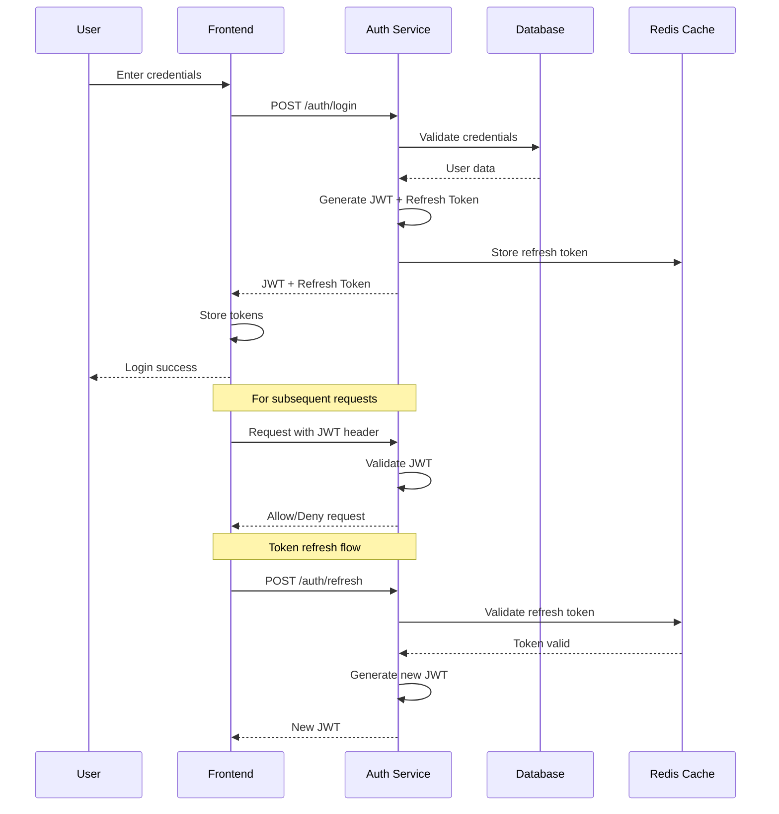

### Authorization Matrix

| Role | Clients | Cases | Documents | Time Tracking | Invoicing | Reports | Admin |
|------|---------|-------|-----------|---------------|-----------|---------|-------|
| **Admin** | CRUD | CRUD | CRUD | CRUD | CRUD | CRUD | CRUD |
| **Attorney** | CRUD | CRUD (assigned) | CRUD | CRUD (own) | CR | CR | - |
| **Paralegal** | CR | RU (assigned) | CRUD | CRUD (own) | - | R | - |
| **Assistant** | RU | R (assigned) | RU | - | R | R | - |
| **Billing** | R | R | R | R | CRUD | CR | - |
| **Client** | R (own) | R (own) | R (own) | - | R (own) | - | - |

*Legend: C=Create, R=Read, U=Update, D=Delete*

### Role-Based Access Control (RBAC)

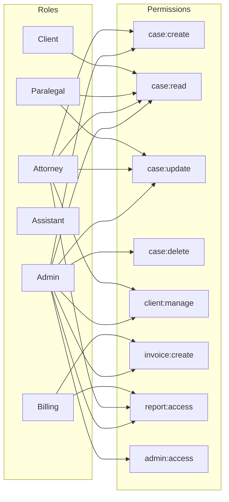

---

## Core Workflows

### 1. Client Intake Workflow

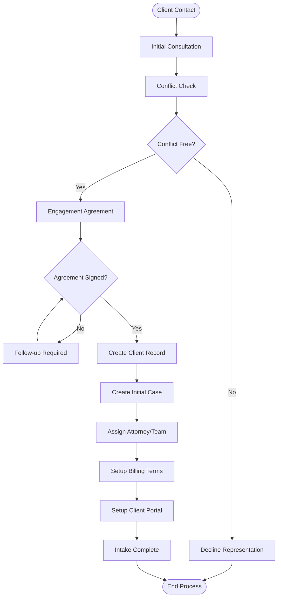

### 2. Case Management Workflow

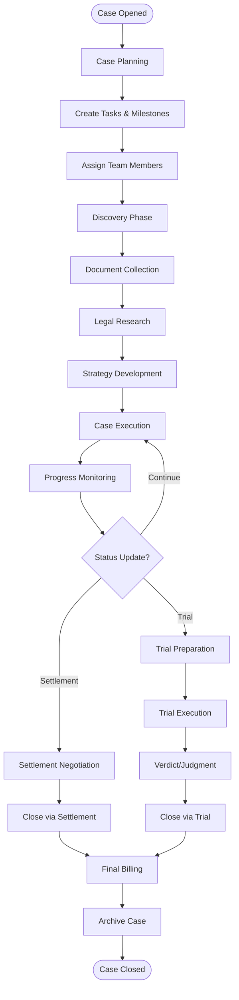

### 3. Document Management Workflow

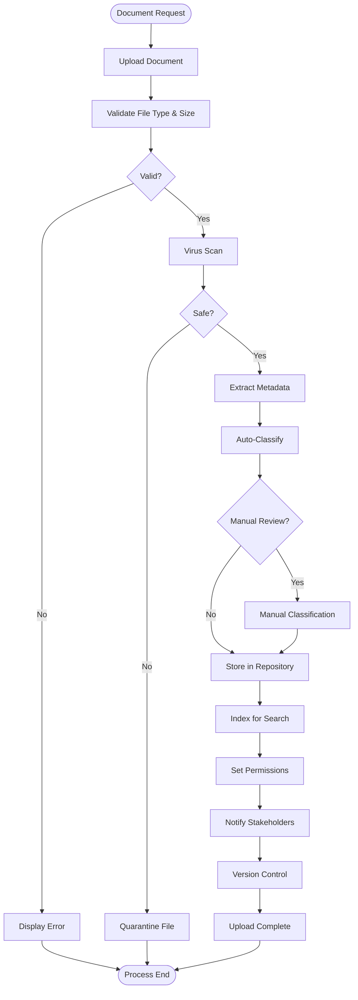

### 4. Time Tracking & Billing Workflow

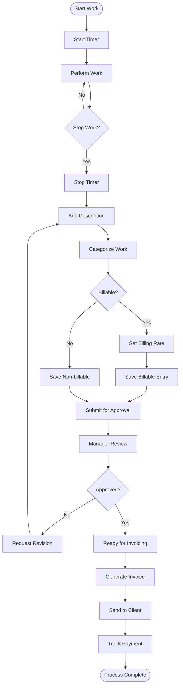

---

## Technology Stack

### Frontend Stack

| Technology | Version | Purpose |
|------------|---------|---------|
| **React** | 18.3.1 | Core UI framework |
| **TypeScript** | 5.5.3 | Type safety and developer experience |
| **Vite** | 5.4.1 | Build tool and development server |
| **React Router** | 6.26.2 | Client-side routing |
| **Tailwind CSS** | 3.4.11 | Utility-first styling |
| **shadcn/ui** | Latest | Component library |
| **React Query** | 5.56.2 | Server state management |
| **React Hook Form** | 7.56.4 | Form handling |
| **Zod** | 3.25.34 | Schema validation |
| **Recharts** | 2.12.7 | Data visualization |
| **Lucide React** | 0.462.0 | Icon library |

### Backend Stack (Recommended)

| Technology | Purpose |
|------------|---------|
| **Node.js** | Runtime environment |
| **Express.js/Fastify** | Web framework |
| **TypeScript** | Type safety |
| **PostgreSQL** | Primary database |
| **Prisma/TypeORM** | ORM |
| **Redis** | Caching and sessions |
| **JWT** | Authentication tokens |
| **Multer** | File upload handling |
| **Nodemailer** | Email sending |
| **Winston** | Logging |
| **Jest** | Testing framework |

### Infrastructure Stack

| Component | Technology | Purpose |
|-----------|------------|---------|
| **Container** | Docker | Application containerization |
| **Orchestration** | Kubernetes | Container orchestration |
| **Database** | PostgreSQL 15+ | Primary data storage |
| **Cache** | Redis 7+ | Caching and session storage |
| **File Storage** | AWS S3/MinIO | Document and file storage |
| **Search** | Elasticsearch 8+ | Full-text search |
| **Message Queue** | RabbitMQ/AWS SQS | Async processing |
| **Monitoring** | Prometheus + Grafana | System monitoring |
| **Logging** | ELK Stack | Centralized logging |

---

## Component Architecture

### Frontend Component Hierarchy

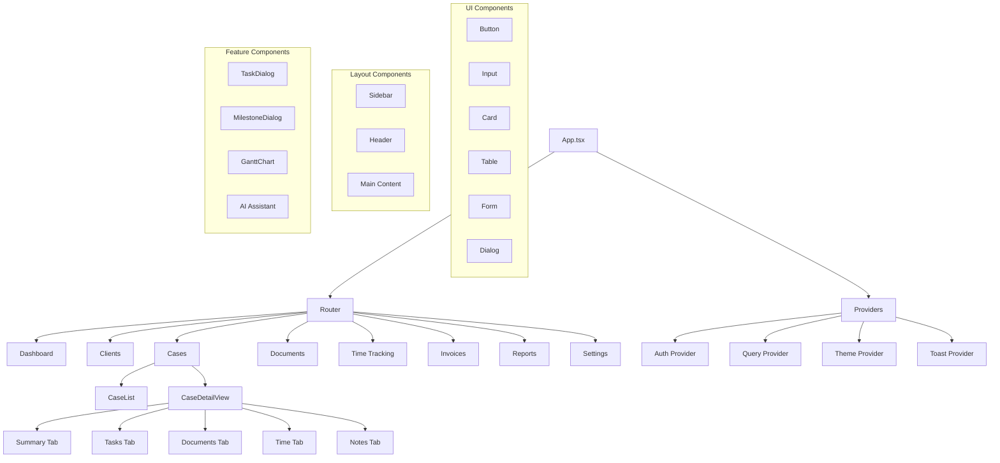

### State Management Architecture

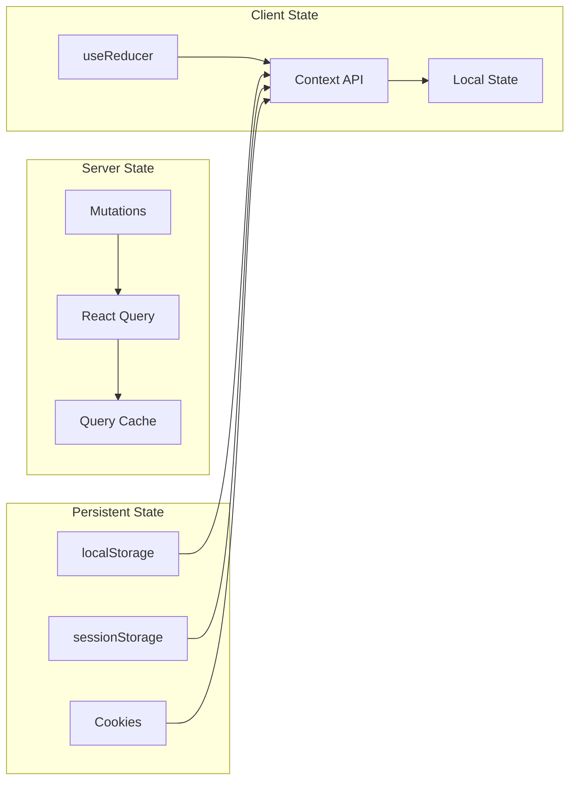

---

## Data Flow Diagrams

### Case Management Data Flow

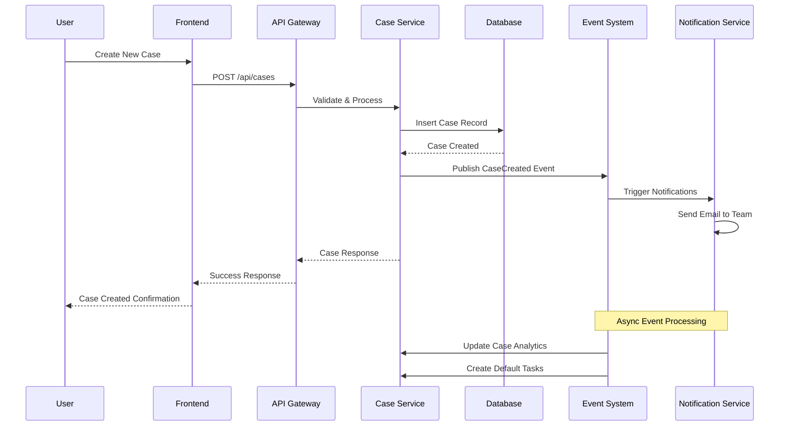

### Document Upload Data Flow

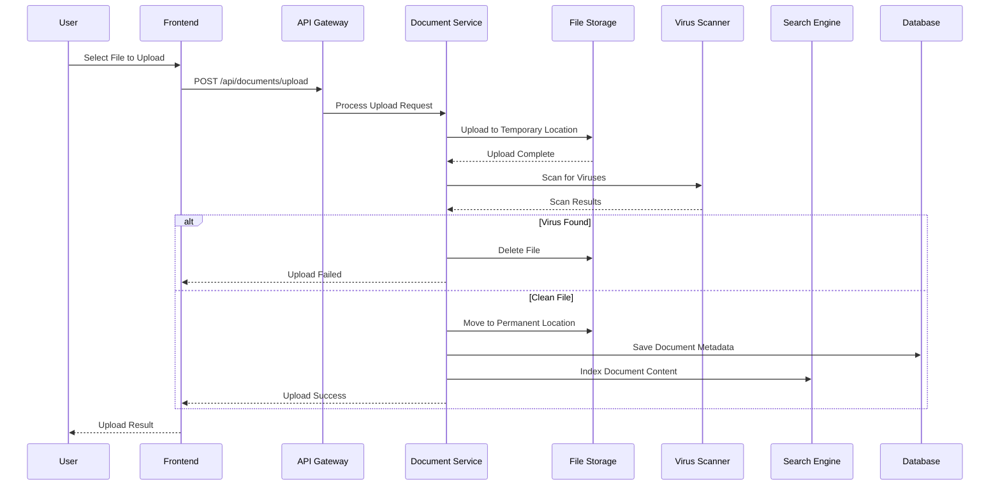

---

## API Design

### RESTful API Endpoints

#### Authentication Endpoints
```
POST   /api/auth/login           # User login
POST   /api/auth/logout          # User logout
POST   /api/auth/refresh         # Refresh token
POST   /api/auth/forgot-password # Password reset request
POST   /api/auth/reset-password  # Password reset confirmation
```

#### Client Management
```
GET    /api/clients              # List clients (with pagination)
GET    /api/clients/:id          # Get specific client
POST   /api/clients              # Create new client
PUT    /api/clients/:id          # Update client
DELETE /api/clients/:id          # Delete client
GET    /api/clients/:id/cases    # Get client's cases
```

#### Case Management
```
GET    /api/cases                # List cases (with filters)
GET    /api/cases/:id            # Get specific case
POST   /api/cases                # Create new case
PUT    /api/cases/:id            # Update case
DELETE /api/cases/:id            # Delete case
GET    /api/cases/:id/documents  # Get case documents
GET    /api/cases/:id/time-entries # Get case time entries
POST   /api/cases/:id/tasks      # Create case task
GET    /api/cases/:id/milestones # Get case milestones
```

#### Document Management
```
GET    /api/documents            # List documents
GET    /api/documents/:id        # Get document metadata
POST   /api/documents            # Upload document
PUT    /api/documents/:id        # Update document
DELETE /api/documents/:id        # Delete document
GET    /api/documents/:id/download # Download document
POST   /api/documents/:id/share  # Share document
```

#### Time Tracking
```
GET    /api/time-entries         # List time entries
GET    /api/time-entries/:id     # Get specific entry
POST   /api/time-entries         # Create time entry
PUT    /api/time-entries/:id     # Update time entry
DELETE /api/time-entries/:id     # Delete time entry
POST   /api/time-entries/:id/submit # Submit for approval
POST   /api/time-entries/:id/approve # Approve entry
```

### API Response Standards

#### Success Response Format
```json
{
  "success": true,
  "data": {
    // Response data
  },
  "meta": {
    "pagination": {
      "page": 1,
      "limit": 20,
      "total": 150,
      "pages": 8
    }
  }
}
```

#### Error Response Format
```json
{
  "success": false,
  "error": {
    "code": "VALIDATION_ERROR",
    "message": "Validation failed",
    "details": [
      {
        "field": "email",
        "message": "Invalid email format"
      }
    ]
  }
}
```

---

## Security Architecture

### Security Layers

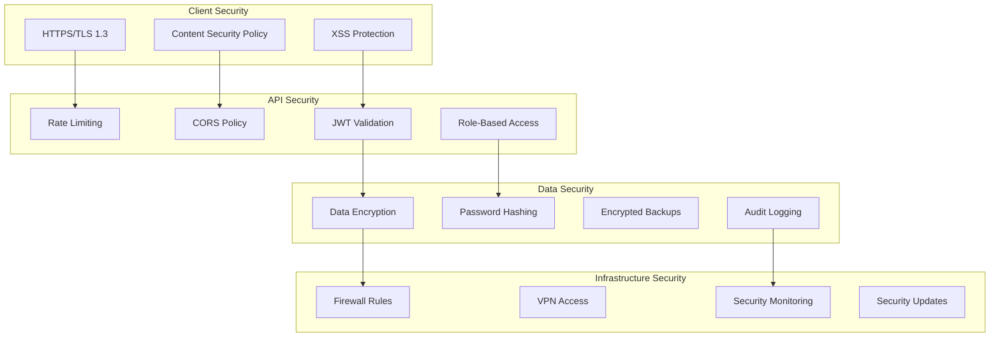

### Data Protection Measures

1. **Encryption at Rest**: All sensitive data encrypted using AES-256
2. **Encryption in Transit**: TLS 1.3 for all communications
3. **Password Security**: Bcrypt hashing with salt rounds
4. **Access Control**: Multi-level authentication and authorization
5. **Audit Trails**: Comprehensive logging of all user actions
6. **Data Backup**: Encrypted, geographically distributed backups
7. **Compliance**: GDPR, HIPAA, and legal industry standard compliance

### Security Monitoring

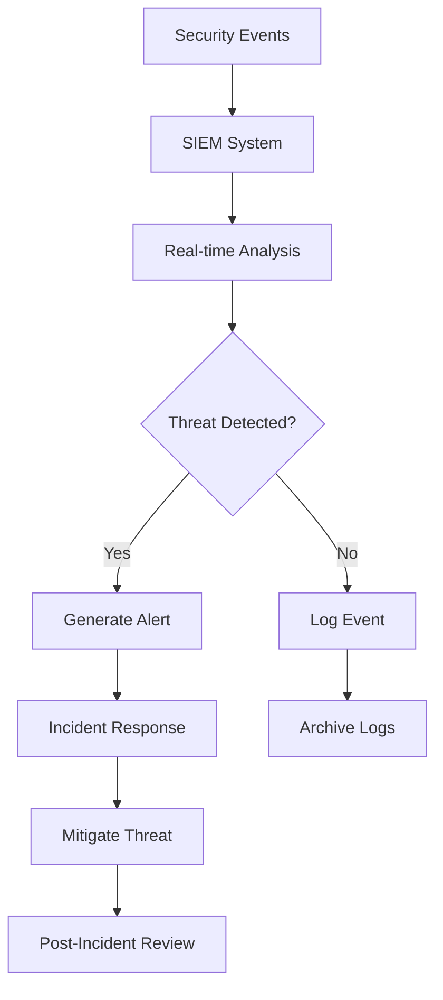

---

## Conclusion

The Sebenza System architecture provides a robust, scalable, and secure platform for law firm management. The microservices architecture ensures flexibility and maintainability, while the comprehensive security measures protect sensitive legal data. The React-based frontend provides an intuitive user experience, and the well-defined API enables future integrations and mobile applications.

Key architectural strengths:
- **Scalability**: Microservices architecture supports horizontal scaling
- **Security**: Multi-layered security approach with comprehensive audit trails
- **Maintainability**: Clear separation of concerns and well-documented APIs
- **Extensibility**: Plugin architecture and API-first design enable customization
- **Performance**: Caching strategies and optimized database queries ensure responsiveness

This architecture serves as the foundation for a modern, efficient law firm management system that can adapt to evolving business needs while maintaining the highest standards of security and reliability.
